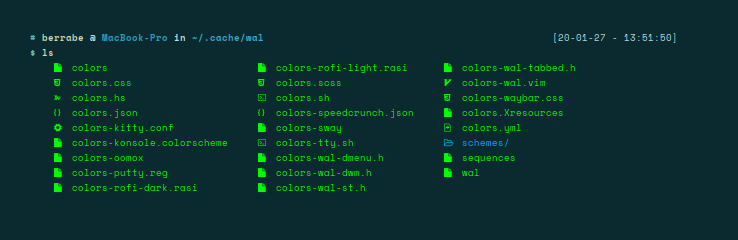

# Screenshot

# List App
| Type | App |
| --- | --- |
| **WM** |  [i3-gaps](https://github.com/Airblader/i3/wiki/Installation) |
| **Panel** | tint2 |
| **Compositor** | compton / [compton-tryone-kawasake-blur](Programs/compton)  |
| **Notifier** | dunst |
| **App Launcher** | rofi |
| **Color Generator** | [pywal](https://github.com/dylanaraps/pywal/wiki)|
| **Icon** | [Papirus-Dark](https://github.com/PapirusDevelopmentTeam/papirus-icon-theme#installation) |
| **GTK Theme** | [Sierra-Dark](https://github.com/vinceliuice/Sierra-gtk-theme) |
| **Mouse Theme** | [Capitaine-Cursor](https://launchpad.net/~dyatlov-igor/+archive/ubuntu/la-capitaine) |
| **Music Player** | [ncmpcpp mpc mpd](https://addy-dclxvi.github.io/post/configuring-ncmpcpp/) |
| **Shell** | zsh oh-my-zsh |
| **dir listing** | [colorls](https://www.omgubuntu.co.uk/2017/07/add-bling-ls-bash-command-colorls) |
| **Image Viewer** | viewnior |
| **System Info** | neofetch |
| **Terminal Clock** | tty-clock |

# pywal
> pywal is used to change the color scheme of the terminal and also the color of rofi
> see the configuration file automatically created by pywal at **.cache/wal/**
> in pywal there is a bug if using xfce4-terminal, use pywal --vte -i image.png

