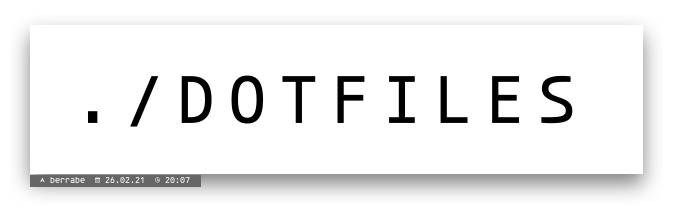
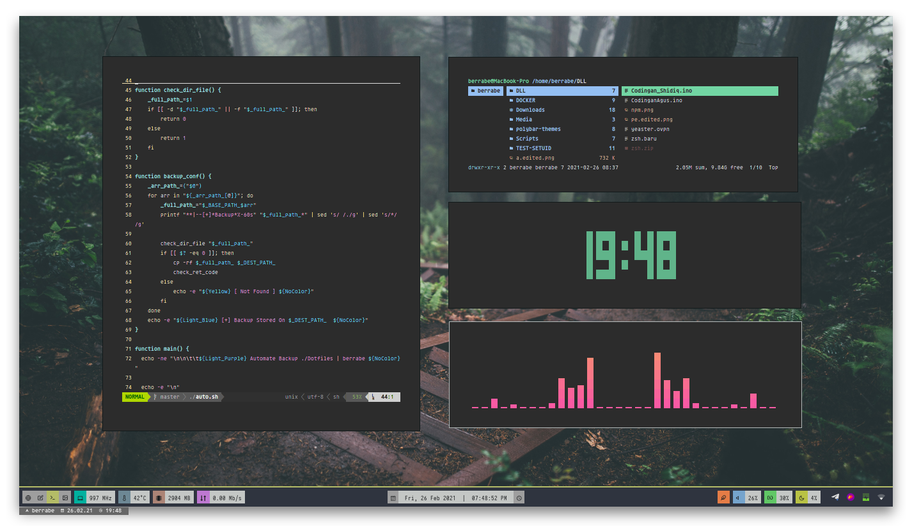
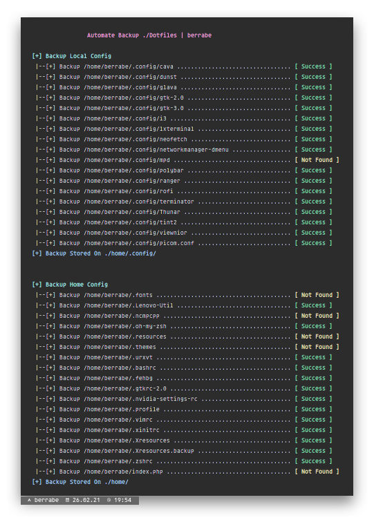
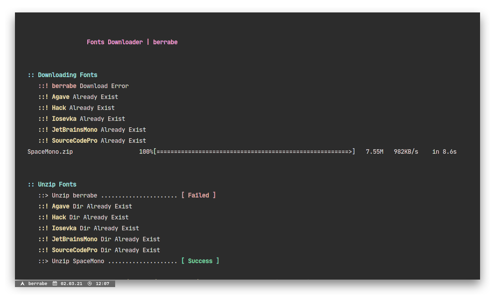

  

  

### 1 - Screenshot
---

  

  

  

### 2 - List App
---
| Type | App |
| --- | --- |
| **WM** |  [i3-gaps](https://github.com/Airblader/i3/wiki/Installation) |
| **Panel** | tint2 - polybar |
| **Compositor** | [compton](https://launchpad.net/~kgilmer/+archive/ubuntu/speed-ricer)
| **Notifier** | dunst |
| **App Launcher** | rofi |
| **Color Generator** | [pywal](https://github.com/dylanaraps/pywal/wiki)|
| **Icon** | [Papirus-Dark](https://github.com/PapirusDevelopmentTeam/papirus-icon-theme#installation) |
| **GTK Theme** | [Sierra-Dark](https://github.com/vinceliuice/Sierra-gtk-theme) |
| **Mouse Theme** | [Capitaine-Cursor](https://launchpad.net/~dyatlov-igor/+archive/ubuntu/la-capitaine) |
| **Music Player** | cmus - [ncmpcpp - mpc - mpd](https://addy-dclxvi.github.io/post/configuring-ncmpcpp/) |
| **Shell** | zsh - oh-my-zsh |
| **dir listing** | [colorls](https://www.omgubuntu.co.uk/2017/07/add-bling-ls-bash-command-colorls) |
| **Image Viewer** | viewnior |
| **GTK+ Setting** | lxappearance |
| **System Info** | neofetch |
| **Terminal Clock** | tty-clock |
| **File Manager** | thunar - ranger |
| **Lock System** | i3lock |
| **Media Capture** | kazam - scrot - feh - import - flameshot - SSR |
| **Music Visualizer** | [cava](https://github.com/karlstav/cava) |
| **CPU Monitor** | [s-tui](https://github.com/amanusk/s-tui) - ytop - gotop |
| **Multi Monitor Stuff** | pasystray - pavucontrol - arandr |

  

